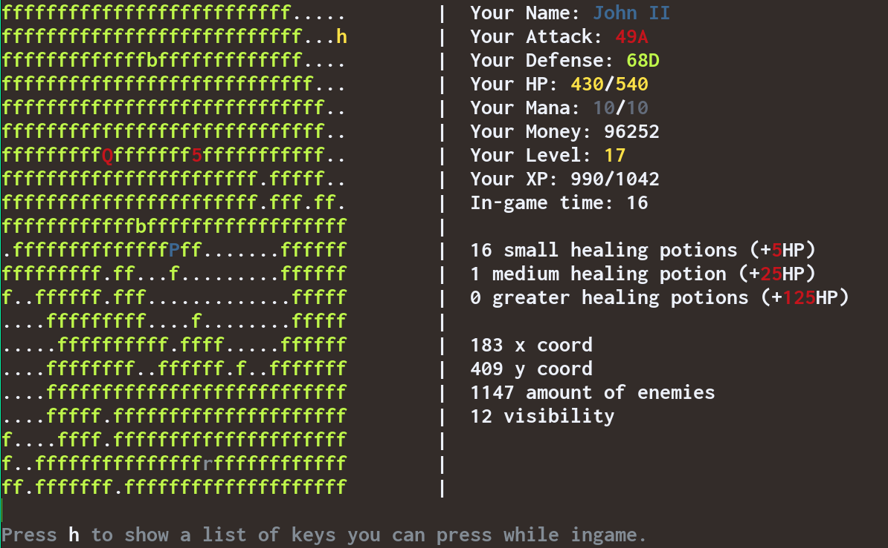
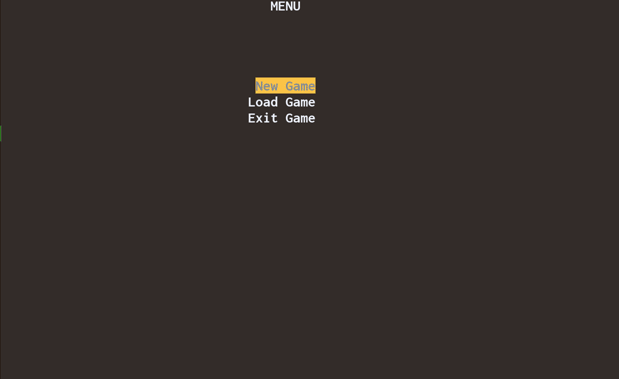

# Aceth - an ASCII rogue-like written in C++

This is a project I wrote back in 2015, this was my first fairly large project I did when I was learning programming. I rediscovered it and saw that it was actually fairly feature-full. Although the code quality is terrible to say the least. The entire project consists of a single file of 3000+ lines, without a single class or struct. Everything is in methods, which are all called in a single game loop. More on the funny code stuff I found later, first let me show what it looks like as it is still a bit of fun.

# Showcase 





# Features

* A map generator which creates various biomes (forests, swamps and even arctic wastelands) as well as caves, castles and villages
* 77 different enemies which spawn in various biomes depending on the player Level
* 20 levels the player can attain
* An inventory system with 4 different types of gear the player can find or buy
* A fairly simple combat system
* Hacky async movement of enemies while idle
* A day and night cycle which makes your view-field smaller during the night
* Various help pages for enemy-types, terrain types etc.

# Playing

Compile and create the maps, then run the game in the game directory:

With make:
```
make
./MapGenerator
./Aceth

**Note that without creating maps you won't be able to create a new game**
```

Alternatively just compile the `src/main.cpp` and `src/MapGenerator.cpp` files and place the executables in the cloned folder so it has access to the `saves` and `data` folders.

# Guide

If you do actually want to try it out, here is a short guide:
during the first levels it's advisable to explore a lot and find treasure chests `C` which contain
money and items. Explore all caves `c` and houses especially `h`. In the caves there are a lot of chests,
be careful of stronger monsters though. In the houses there are potion shops `p` and item shops `S`.
Definitely check them out and buy potions frequently. Try to fight easy monsters without dying, use
`h`, `j` and `k` for help in finding what monster you are facing. Remember to equip better items as soon
as you get them with `i`.

# Gems found in the code

As mentioned previously the code is awful. I appreciate it as a reminder of how much I have improved during the years.

## Version Control

Back then I didn't know about git, so all my backups looked like this: 

```
└── Quest for Something - 500x500
   ├── backups
   │  ├── main -2015 02 17   22 50.cpp
   │  ├── main500 2015 03 01   23 17.cpp
   │  ├── main500 2015 03 01   23 54.cpp
   │  ├── main500 2015 03 03   16 26.cpp
   │  ├── main 2015 02 15   22 50.cpp
   │  ├── main 2015 02 16   00 30.cpp
   │  ├── main 2015 02 16   12 35.cpp
   │  ├── main 2015 02 17   00 47.cpp
          ...
```

And there were multiple folders like this, the only way to know in hindsight which the newest was, was to check the LOC in the main.cpp file.

I also had no understanding of classes or OOP for that matter.

## Couple of examples

Very verbose way to write `showTips = !showTips`:
```cpp
if (showTips == false)
{
    showTips = true;
}
else if (showTips == true)
{
    showTips = false;
}
```

---

Having no idea what seeding means I always seeded before every call, so I had problems of always getting the same values as long as it ran the same second. So I counteracted this by using the current tick count in milliseconds, which kind of 'solved' the problem. I also added time(0) multiple times as well as some arbitrary number...
```cpp
default_random_engine randomGenerator(time(0) + time(0) + time(0) + GetTickCount() + myRan);
```


---

Instead of finding the line count from the files, or even from the filenames I separately encoded the line count.
``
const string loadItemsFile = "data/itemList52.tsv";
const string loadSpellFile = "data/spellList13.tsv";
const string loadEnemyFile = "data/enemyList77.tsv";
const int ITEM_AMOUNT = 52;
const int ENEMY_AMOUNT = 77;
const int SPELL_AMOUNT = 13;
```

---

The longest 3 lines in the file have 403, 385, 318 characters respectively. Which is just _slightly_ more than the recommended 80/100/120.

`cat src/main.cpp | awk '{print length($0)" "$0}' | sort -n`

In fact there are 23 lines with more than 200 chars.

`cat src/main.cpp | awk '{if(length($0)>200)print length($0)" "$0 }' | wc -l`
